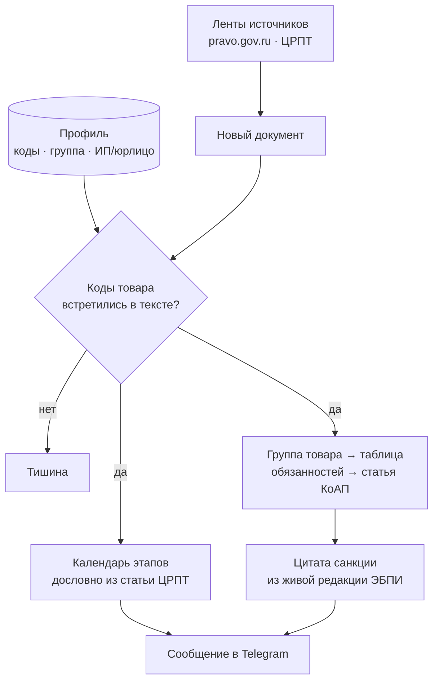

# РегДозор

Телеграм-бот-«дозорный»: следит за изменениями в обязательной маркировке товаров «Честный знак»
и предупреждает продавца **до того**, как изменение станет для него штрафом.

Чистая **Java 21**, без фреймворков. 61 класс, две внешние зависимости.

---

## Зачем

Перечень товаров, подлежащих обязательной маркировке, расширяется волнами. Постановление выходит
заранее, но продавец о нём не узнаёт: он не читает `pravo.gov.ru` и не следит за публикациями ЦРПТ.
Через несколько месяцев наступает дата — и товар на витрине оказывается вне закона.

Цена вопроса для ИП по ст. 15.12 ч.1 КоАП РФ — штраф **с конфискацией товара**; для юрлица суммы
на порядок выше. Узнать об этом от инспектора дороже, чем от бота.

**Бот отвечает на три вопроса и ровно на них:**

| вопрос | откуда берётся ответ |
|---|---|
| Это касается **моего** товара? | коды ТН ВЭД + ОКПД2 из профиля сверяются с текстом документа |
| Что меняется и **когда**? | дословная цитата календаря внедрения из статьи ЦРПТ |
| Чем **грозит** нарушение? | цитата санкции из живой редакции КоАП, под правовую форму клиента |

Чего бот **не** делает: не даёт юридических консультаций, не пересказывает закон своими словами
и не считает штраф — он **цитирует первоисточник** и даёт ссылку. Каждое сообщение снабжено
дисклеймером.

---

## Как это работает



**Молчание — штатный режим.** Если коды не совпали, бот не пишет ничего: сообщение, которого не
должно быть, не создаётся.

### Три яруса источников

1. **`pravo.gov.ru`** — официальная публикация актов. Авторитетный «невод»: изменения перечня
   рождаются в постановлениях правительства, и этот ярус гарантирует, что бот не промолчит,
   даже если пересказа нигде не появится.
2. **ЦРПТ** (`markirovka.ru`, `честныйзнак.рф`) — оператор маркировки. Готовые таблицы кодов
   и календари волн. Материалы оператора **можно цитировать** с указанием источника.
3. Коммерческие блоги и агрегаторы — **только для навигации**, в сообщения не попадают.

Текст самих нормативных актов берётся из **ЭБПИ** (банк действующих редакций) — так цитата всегда
из редакции, действующей сегодня, а не из копии, устаревшей полгода назад.

---

## Устройство кода

Пакеты `org.regdozor.*`:

| пакет | ответственность |
|---|---|
| `net` | HTTP-качалка |
| `pravo` | ярус 1: лента публикаций + текст актов из ЭБПИ |
| `operator` | ярус 2: ленты и статьи ЦРПТ (`markirovka.ru`, `честныйзнак.рф`) |
| `match` | сверка кодов, поиск статьи КоАП, извлечение санкции |
| `profile` | профиль клиента: товары, коды, правовая форма |
| `report` | координаторы: что проверить, что и кому сказать |
| `telegram` | бот: приём подписок, рассылка |
| `store` | состояние в плоских файлах |
| `util` | мелкие общие помощники |

Точка входа — `org.regdozor.App`: собирает зависимости вручную (без DI-контейнера) и ставит
два планировщика — дозор и приёмник подписчиков.

### Решения, определяющие архитектуру

**Обязанности берутся от товарной группы, а не вычитываются из текста статьи.** Статьи ЦРПТ пишут
живым языком и не называют обязанности терминами; классификация по ключевым словам давала бы
бесшумные промахи. Поэтому связка «группа → статья КоАП» лежит в выверенной вручную таблице
(`obligations.json`), а из статьи берутся только даты и дословные цитаты.

**Штраф не парсится, а цитируется.** Суммы в КоАП записаны словами, и разбирать их — значит
однажды ошибиться в цифре. Бот вырезает нужный абзац живой редакции и приводит его как есть.

**Правовая форма влияет на цитату.** У ИП и юрлица за одно и то же нарушение разные абзацы санкции
и разные суммы — бот выбирает нужный по профилю.

**Сторож («канарейка») обязателен.** Бот стоит на разборе чужих HTML-страниц и недокументированного
API. Смена вёрстки не приводит к падению — парсер просто вернёт пустоту, и дозор **замолчит навсегда,
а пользователь решит, что изменений нет**. Для дозорного это худший вид отказа. Поэтому пустой
результат нигде не возвращается молча: каждый разборщик проверяет известный факт на известном
документе и падает с внятным текстом.

---

## Сборка и запуск

Нужен **JDK 21+** и Maven.

```bash
mvn clean package
```

Получится самодостаточный jar: `target/regdozor.jar`.

```bash
java -Dstdout.encoding=UTF-8 -Dstderr.encoding=UTF-8 -jar target/regdozor.jar
```

Флаги кодировки обязательны на Windows — без них лог пишется в системной кодировке.

### Настройка

**Переменная окружения:**

| переменная | назначение |
|---|---|
| `TG_BOT_TOKEN` | токен бота от [@BotFather](https://t.me/BotFather) |

Токен читается только из окружения и никогда не пишется в лог: он является частью URL Telegram Bot API,
поэтому любой вывод адреса запроса — это утечка.

**Файлы данных** (`src/main/resources`):

| файл | содержимое |
|---|---|
| `profile.json` | профиль клиента: товары с кодами ТН ВЭД и ОКПД2, товарная группа, правовая форма |
| `obligations.json` | таблица «группа + обязанность → статья КоАП, часть» |

**Рабочее состояние** пишется в `data/` (каталог не хранится в репозитории): реестр подписчиков,
списки уже обработанных документов, лог.

---

## Состояние проекта

Работает end-to-end: бот принимает подписки, следит за источниками, сверяет коды и шлёт
пер-товарные уведомления с календарём и цитатами КоАП.

**В работе:** профиль на каждого подписчика и диалог первичной настройки — сейчас профиль
общий, поэтому подписчик-юрлицо увидел бы суммы, рассчитанные для ИП.

**Дальше:** автоматические тесты, статический анализ, контейнеризация и вынос на постоянный хостинг.

---

## Ограничения

Бот **не является** юридической консультацией и не заменяет её. Он показывает цитаты первоисточников
и ссылки на них; решения принимает человек. Данные берутся из открытых официальных источников;
разбор чужих страниц по своей природе хрупок — на этот случай в проекте есть сторож, который
поднимает тревогу вместо того, чтобы молчать.

---

## Лицензия

Не определена. Проект разрабатывается для конкретного клиента.
